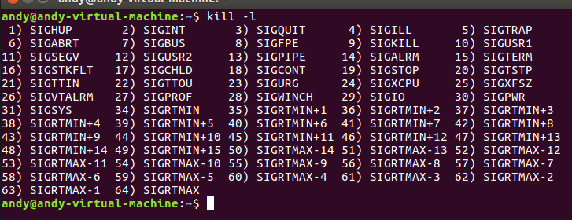

## 信号概述

### 信号种类
信号是进程间通信机制中唯一的异步通信机制，一个进程不必通过任何操作来等待信号的到达，事实上， 进程也不知道信号到底什么时候到达。正如我们所了解的中断服务函数一样，在中断发生的时候， 就会进入中断服务函数中去处理，同样的，当进程接收到一个信号的时候，也会相应地采取一些行动。 我们可以使用术语“生成（raise）”表示一个信号的产生，使用术语“捕获（catch）”表示进程接收到一个信号。

在Linux系统中，信号可能是由于系统中某些错误而产生，也可以是某个进程主动生成的一个信号。

我们可以使用kill 命令来查看系统中支持的信号种类：

kill -l



其中我解释几个关键信号
1       SIGHUP           控制终端被关闭时产生。
2       SIGINT           程序终止(interrupt)信号，在用户键入INTR字符（通常是Ctrl + C）时发出，用于通知前台进程组终止进程。
7       SIGBUS           总线错误时产生。一般是非法地址，包括内存地址对齐（alignment）出错。
9       SIGKILL          系统杀戮信号。用来立即结束程序的运行，本信号不能被阻塞、处理和忽略。
10      SIGUSR1          用户自定义信号1。
11      SIGSEGV          访问非法内存时产生，进程试图访问未分配给自己的内存，或试图往没有写权限的内存地址写数据。
14      SIGALRM          定时器到期信号，计算的是实际的时间或时钟时间，alarm函数使用该信号。
17      SIGCHLD          子进程暂停或终止时产生，父进程收到这个信号，如果父进程没有处理这个信号，也没有等待（wait）子进程，子进程虽然终止，但是还会在内核进程表中占有表项，僵尸


### 非实时信号与实时信号

Linux 系统中有许多信号，其中前面 31 个信号都有一个特殊的名字，对应一个特殊的事件， 比如 信号值为1的信号SIGHUP（Signal Hang UP），这个信号就是通知系统关闭中断的， 当系统中的一个控制终端被关闭（即挂断，hang up）时，都会产生这个信号。

信号值为1~31的信号属性非实时信号，它主要是因为这类信号不支持排队， 因此信号可能会丢失。比如发送多次相同的信号，进程只能收到一次， 也只会处理一次，因此剩下的信号将被丢弃。而实时信号（信号值为34~64的信号）则不同， 它是支持排队的，发送了多少个信号给进程，进程就会处理多少次。

Linux 系统中有许多信号，其中前面 31 个信号都有一个特殊的名字，对应一个特殊的事件， 比如 信号值为1的信号SIGHUP（Signal Hang UP），这个信号就是通知系统关闭中断的， 当系统中的一个控制终端被关闭（即挂断，hang up）时，都会产生这个信号。

信号值为1~31的信号属性非实时信号，它主要是因为这类信号不支持排队， 因此信号可能会丢失。比如发送多次相同的信号，进程只能收到一次， 也只会处理一次，因此剩下的信号将被丢弃。而实时信号（信号值为34~64的信号）则不同， 它是支持排队的，发送了多少个信号给进程，进程就会处理多少次。

## 信号编程知识

### signal()

signal()主要是用于捕获信号，可以改变进程中对信号的默认行为，我们在捕获这个信号后， 也可以自定义对信号的处理行为，当收到这个信号后，应该如何去处理它， 这也是我们在开发Linux最常使用的方式。

```C title="signal()函数使用实例"
typedef void (*sighandler_t)(int);

sighandler_t signal(int signum, sighandler_t handler);
```

signum是指定捕获的信号，如果指定的是一个无效的信号， 或者尝试处理的信号是不可捕获或不可忽略的信号（如SIGKILL），errno将被设置为EINVAL。

handler是一个函数指针，它的类型是 void(*sighandler_t)(int) 类型，拥有一个int类型的参数， 这个参数的作用就是传递收到的信号值，返回类型为void。

signal()函数会返回一个sighandler_t类型的函数指针，这是因为调用signal()函数修改了信号的行为， 需要返回之前的信号处理行为是哪个，以便让应用层知悉， 如果修改信号的默认行为识别则返回对应的错误代码SIG_ERR。

handler需要用户自定义处理信号的方式，当然还可以使用以下宏定义：

SIG_IGN：忽略该信号。

SIG_DFL：采用系统默认方式处理信号。


### sigaction()
sigaction()函数原型如下：
```C title="sigaction()函数原型"
int sigaction(int signum, const struct sigaction *act, struct sigaction *oldact);
//signum 指定捕获的信号值。
//act：是一个结构体，该结构体的内容如下：
struct sigaction {
            void     (*sa_handler)(int);  //是一个函数指针，是捕获信号后的处理函数，它也有一个int类型的参数，传入信号的值，这个函数是标准的信号处理函数。
            void     (*sa_sigaction)(int, siginfo_t *, void *); //扩展信号处理函数，不予上个同时使用
            sigset_t   sa_mask;   //信号掩码，它指定了在执行信号处理函数期间阻塞的信号的掩码
            int        sa_flags;  //sa_flags是指定一系列用于修改信号处理过程行为的标志，由下面的0个或多个标志组合而成：
                                    //SA_RESETHAND   信号处理之后重新设置为默认的处理方式。
                                    //SA_SIGINFO  指示使用sa_sigaction成员而不是使用sa_handler 成员作为信号处理函数。
                                    //SA_NOCLDWAIT  表示父进程在它的子进程终止时不会收到SIGCHLD 信号， 这时子进程终止则不会成为僵尸进程。
            void     (*sa_restorer)(void);//已经废弃的成员变量
        };
//oldact：返回原有的信号处理参数，一般设置为NULL即可。
```


### kill()
kill()函数可以向指定的进程发送一个信号。其函数原型如下：

```C title="kill()函数原型"
int kill(pid_t pid, int sig);
```
其中，pid是接收信号的进程ID，sig是要发送的信号，可以是预定义的信号常量，也可以是自定义的信号


###  raise()
raise()函数是发送信号函数，raise函数只是进程向自身发送信号的函数，不可以向其他进程发送信号，
```C title="raise()函数原型"
int raise(int sig);
```

raise()函数只有一个参数sig，它代表着发送的信号值，如果发送成功则返回0，发送失败则返回-1，

### alarm()
alarm()也称为闹钟函数，它可以在进程中设置一个定时器，当定时器指定的时间seconds到时， 它就向进程发送SIGALARM信号。其函数原型如下：
```C title="alarm()函数原型"
unsigned int alarm(unsigned int seconds);
```
如果在seconds秒内再次调用了alarm()函数设置了新的闹钟，则新的设置将覆盖前面的设置， 即之前设置的秒数被新的闹钟时间取代。它的返回值是之前闹钟的剩余秒数，如果之前未设闹钟则返回0。 特别地，如果新的seconds为0，则之前设置的闹钟会被取消，并将剩下的时间返回。

