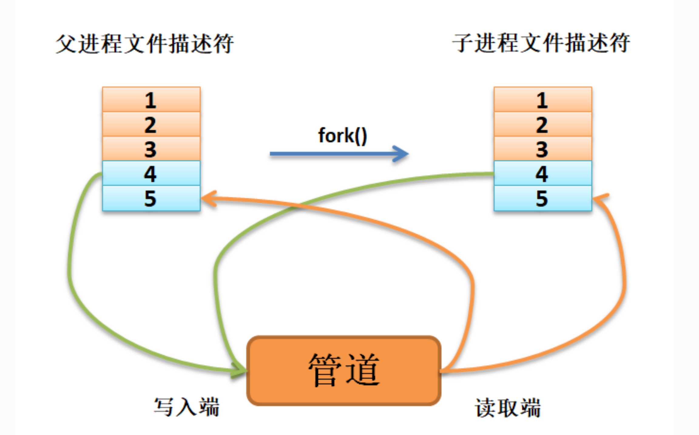
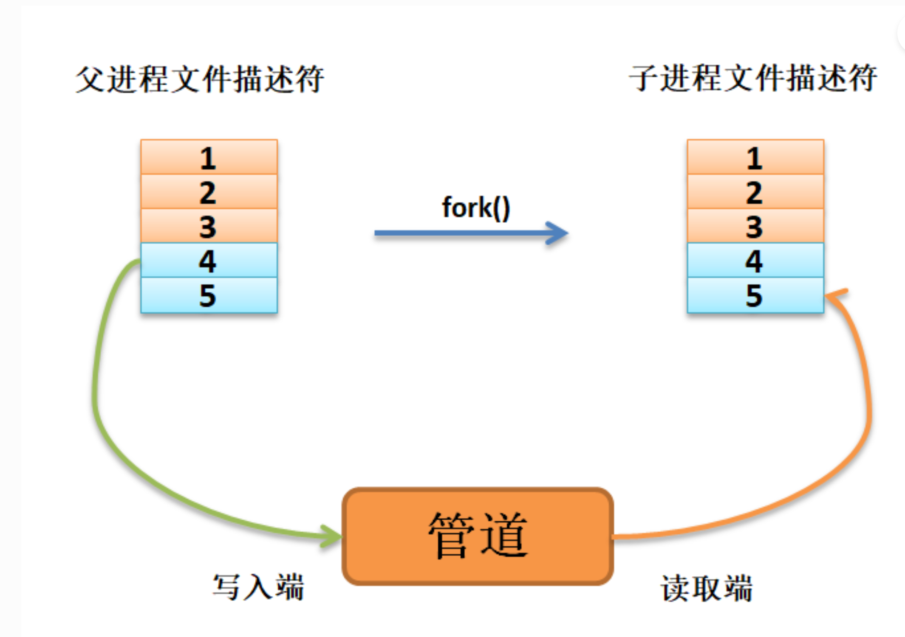

## 管道概述
什么是管道呢？当数据从一个进程连接流到另一个进程时，这之间的连接就是一个管道（pipe）。
对于shell命令行，我们最常使用的就是 find . -name andy | grep love  其中的“ | ”字符就是管道

### 管道分类

管道分为有名管道与无名管道 
对于无名管道 
其中上文提到的 “ | ”就是无名管道 ，无名管道是一种半双工的、只能在父子进程或者兄弟进程之间使用的管道，因为没有文件名只能在父子进程中运行
匿名管道的创建需要调用pipe()函数，返回两个文件描述符，分别代表管道的读取和写入端。
而对于有名管道最有名的莫过于FIFO（first-in first-out）

##  pipe()函数
pipe()函数用于创建一个匿名管道，一个可用于进程间通信的单向数据通道。

```C title="pipe()函数原型"
#include <unistd.h>
int pipe(int pipefd[2]);
```
函数原型非常简单，没有任何的传入参数，注意：数组pipefd是用于返回两个引用管道末端的文件描述符， 它是一个由两个文件描述符组成的数组的指针。pipefd[0] 指管道的读取端，pipefd[1]指向管道的写端 

父进程调用pipe()函数创建匿名管道，得到两个文件描述符pipefd[0]、pipefd[1]， 分别指向管道的读取端和写入端。

父进程调用fork()函数启动（创建）一个子进程， 那么子进程将从父进程中继承这两个文件描述符pipefd[0]、pipefd[1]， 它们指向同一匿名管道的读取端与写入端。
如图所示：


如果想要从父进程将数据传递给子进程，则父进程需要关闭读取端，子进程关闭写入端， 如图


接下来我将使用fork与pipe函数完成父子进程间通讯

```C title="pipe()函数使用实例"
#include <unistd.h>
 #include <sys/types.h>
 #include <sys/wait.h>
 #include <errno.h>
 #include <stdio.h>
 #include <stdlib.h>
 #include <string.h>

 #define MAX_DATA_LEN 256
 #define DELAY_TIME 1

 int main()
 {
     pid_t pid;
     int pipe_fd[2];                             //(1)
     char buf[MAX_DATA_LEN];
     const char data[] = "Pipe Test Program";
     int real_read, real_write;

     memset((void*)buf, 0, sizeof(buf));

     /* 创建管道 */
     if (pipe(pipe_fd) < 0)                  //(2)
     {
         printf("pipe create error\n");
         exit(1);
     }

     /* 创建一子进程 */
     if ((pid = fork()) == 0)                //(3)
     {
         /* 子进程关闭写描述符，并通过使子进程暂停 3s 等待父进程已关闭相应的读描述符 */
         close(pipe_fd[1]);
         sleep(DELAY_TIME * 3);

         /* 子进程读取管道内容 */            //(4)
         if ((real_read = read(pipe_fd[0], buf, MAX_DATA_LEN)) > 0)
         {
             printf("%d bytes read from the pipe is '%s'\n", real_read, buf);
         }

         /* 关闭子进程读描述符 */
         close(pipe_fd[0]);                  //(5)

         exit(0);
     }

     else if (pid > 0)
     {
         /* 父进程关闭读描述符，并通过使父进程暂停 1s 等待子进程已关闭相应的写描述符 */
         close(pipe_fd[0]);                  //(6)

         sleep(DELAY_TIME);

         if((real_write = write(pipe_fd[1], data, strlen(data))) != -1)  //(7)
         {
             printf("Parent write %d bytes : '%s'\n", real_write, data);
         }
         /*关闭父进程写描述符*/
         close(pipe_fd[1]);                  //(8)

         /*收集子进程退出信息*/
         waitpid(pid, NULL, 0);              //(9)

         exit(0);
     }
 }
```

### mkfifo（）函数
mkfifo()的函数原型如下：
```C title="mkfifo()函数原型"
int mkfifo(const char * pathname,mode_t mode);
```
mkfifo()会根据参数pathname建立特殊的FIFO文件，而参数mode为该文件的模式与权限。
mkfifo()创建的FIFO文件其他进程都可以进行读写操作，可以使用读写一般文件的方式操作它， 如open，read，write，close等。

mode模式及权限参数说明：

O_RDONLY：读管道。

O_WRONLY：写管道。

O_RDWR：读写管道。

O_NONBLOCK：非阻塞。

O_CREAT：如果该文件不存在，那么就创建一个新的文件，并用第三个参数为其设置权限。

O_EXCL：如果使用 O_CREAT 时文件存在，那么可返回错误消息。这一参数可测试文件是否存在。

函数返回值说明如下：

0：成功

EACCESS：参数 filename 所指定的目录路径无可执行的权限。

EEXIST：参数 filename 所指定的文件已存在。

ENAMETOOLONG：参数 filename 的路径名称太长。

ENOENT：参数 filename 包含的目录不存在。

ENOSPC：文件系统的剩余空间不足。

ENOTDIR：参数 filename 路径中的目录存在但却非真正的目录。

EROFS：参数 filename 指定的文件存在于只读文件系统内。

```C title="mkfifo()函数使用实例"
#include <sys/wait.h>
 #include <sys/types.h>
 #include <sys/stat.h>
 #include <unistd.h>
 #include <errno.h>
 #include <fcntl.h>
 #include <stdio.h>
 #include <stdlib.h>
 #include <limits.h>
 #include <string.h>

 #define MYFIFO "myfifo"    /* 命名管道文件名*/

 #define MAX_BUFFER_SIZE PIPE_BUF /* 4096 定义在于 limits.h 中*/


 void fifo_read(void)
 {
     char buff[MAX_BUFFER_SIZE];
     int fd;
     int nread;

     printf("***************** read fifo ************************\n");
     /* 判断命名管道是否已存在，若尚未创建，则以相应的权限创建*/
     if (access(MYFIFO, F_OK) == -1)                 //(4)
     {
         if ((mkfifo(MYFIFO, 0666) < 0) && (errno != EEXIST))    //(5)
         {
             printf("Cannot create fifo file\n");
             exit(1);
         }
     }

     /* 以只读阻塞方式打开命名管道 */
     fd = open(MYFIFO, O_RDONLY);                //(6)
     if (fd == -1)
     {
         printf("Open fifo file error\n");
         exit(1);
     }

     memset(buff, 0, sizeof(buff));

     if ((nread = read(fd, buff, MAX_BUFFER_SIZE)) > 0)      // (7)
     {
         printf("Read '%s' from FIFO\n", buff);
     }

    printf("***************** close fifo ************************\n");

     close(fd);                              //(8)

     exit(0);
 }


 void fifo_write(void)
 {
     int fd;
     char buff[] = "this is a fifo test demo";
     int nwrite;

     sleep(2);   //等待子进程先运行              //(9)

     /* 以只写阻塞方式打开 FIFO 管道 */
     fd = open(MYFIFO, O_WRONLY | O_CREAT, 0644);        //(10)
     if (fd == -1)
     {
         printf("Open fifo file error\n");
         exit(1);
     }

     printf("Write '%s' to FIFO\n", buff);

     /*向管道中写入字符串*/
     nwrite = write(fd, buff, MAX_BUFFER_SIZE);          //(11)

     if(wait(NULL))  //等待子进程退出
     {
         close(fd);                          //(12)
         exit(0);
     }

 }


 int main()
 {
     pid_t result;
     /*调用 fork()函数*/
     result = fork();                //(1)

     /*通过 result 的值来判断 fork()函数的返回情况，首先进行出错处理*/
     if(result == -1)
     {
         printf("Fork error\n");
     }


     else if (result == 0) /*返回值为 0 代表子进程*/
     {
         fifo_read();            //(2)
     }

     else /*返回值大于 0 代表父进程*/
     {
         fifo_write();       //(3)
     }

     return result;
 }
```