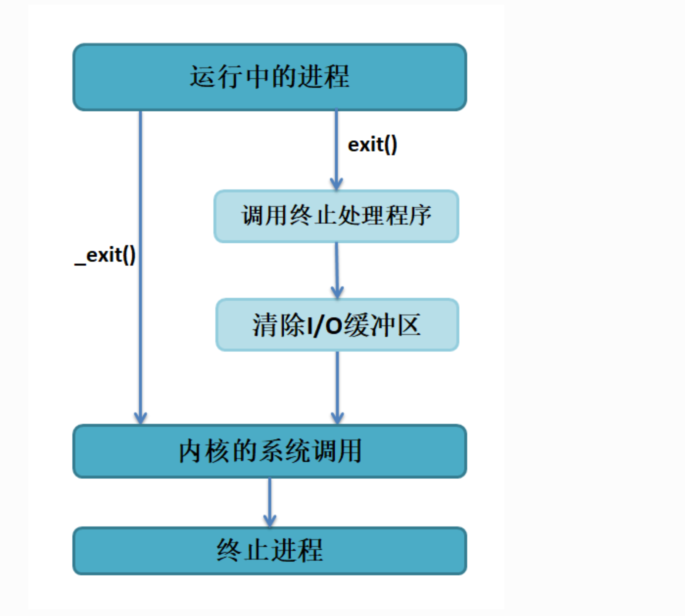

## 进程基础知识

进程（Process）是操作系统中的一个基本概念，它是指正在运行中的一个程序实例。每个进程都有自己的地址空间、堆栈、数据区、代码区等资源，它们彼此独立，互不干扰。进程是操作系统分配资源和调度任务的基本单位，也是进行多任务处理的基础。每个进程有其独特的PID码。
### 进程与线程的区别

本人还是喜欢把线程比做一个桌子上吃饭的人，人可以有很多但是桌子只有一个。而进程就是桌子。线程是执行的最小单位，进程则是资源分配的最小单位。
同时线程间通讯开销小有邮箱，队列等，而进程一般使用管道。


### 进程间状态切换


其中僵尸进程（Zombie Process）是指一个已经终止（结束）的进程，但是它的状态码和其他信息仍然保存在系统进程表中，并且它的父进程没有及时地处理它的退出状态码（exit status）
僵尸进程不会占用太多系统资源，但如果它们过多地积累，就会占用系统进程表的资源，导致系统无法创建新的进程。

## 进程创建及应用编程知识

### system()函数

与python函数中的sys库相同，是同样调用shell命令行，执行程序的方法。

```C title="system（）举例"
#include <sys/types.h>
#include <unistd.h>
#include <stdio.h>
#include <stdlib.h>
int main(void)
{
    pid_t result;

    printf("This is a system demo!\n\n");

    /*调用 system()函数*/
    result = system("ls -l");

    printf("Done!\n\n");

    return result;
}
```

### fork()函数

对于fork函数我们先要明白一点，每个c语言的main函数就是一个线程具有独特的PID码，而fork函数可以创建一个大部分相同的子线程，子进程并不会再次执行fork()函数之前的内容，而fork()函数之后的内容在父进程和子进程都会执行一遍。

使用fork()函数的本质是将父进程的内容复制一份，正如细胞分裂一样， 得到的是几乎两个完全一样的细胞，因此这个启动的子进程基本上是父进程的一个复制品， 但子进程与父进程有不一样的地方，它们的联系与区别简单列举如下：

子进程与父进程一致的内容：

进程的地址空间。
进程上下文、代码段。
进程堆空间、栈空间，内存信息。
进程的环境变量。
标准 IO 的缓冲区。
打开的文件描述符。
信号响应函数。
当前工作路径。


子进程独有的内容：

进程号 PID。 PID 是身份证号码，是进程的唯一标识符。
记录锁。父进程对某文件加了把锁，子进程不会继承这把锁。
挂起的信号。这些信号是已经响应但尚未处理的信号，也就是”悬挂”的信号， 子进程也不会继承这些信号。

其次fork函数的返回值是子线程的pid，而子线程的fock函数则会返回0。

### exec家族函数

事实上，使用fork()函数启动一个子进程是并没有太大作用的，因为子进程与父进程是一样的。但是exec族函数则不同，这个系列函数主要是用于替换进程的执行程序， 它可以根据指定的文件名或目录名找到可执行文件，并用它来取代原调用进程的数据段、代码段和堆栈段， 在执行完之后，原调用进程的内容除了进程号外，其他全部被新程序的内容替换。 另外，这里的可执行文件既可以是二进制文件，也可以是Linux下任何可执行脚本文件。 简单来说就是覆盖进程，将一个进程变得不再存在的同时产生一个新进程，但是内存空间与数据端，代码段不会被释放而是被占用。

exec族实际包含有 6 个不同的 exec 函数，它们功能一样，主要是传参的形式不同

```C title="exec家族"
int execl(const char *path, const char *arg, ...)

int execlp(const char *file, const char *arg, ...)

int execle(const char *path, const char *arg, ..., char *const envp[])

int execv(const char *path, char *const argv[])

int execvp(const char *file, char *const argv[])

int execve(const char *path, char *const argv[], char *const envp[])
```

这些函数可以分为两大类， execl、execlp和execle传递给子程序的参数个数是可变的， 如“ls -la”示例中，“-la”为子程序“ls”的参数。 execv、execvp和execve通过数组去装载子程序的参数，无论那种形式，参数都以一个空指针NULL结束，
接下来我讲演试fork函数与exec函数的结合，实现在子进程执行不同的功能


```C title="fork()与execl的结合使用"
#include <sys/types.h>
#include <unistd.h>
#include <stdio.h>
#include <stdlib.h>
int main(void)
{
    pid_t result;

    printf("This is a execl functional testing !\n\n");

    /*调用 fock()函数*/
    result = fork();

        /*通过 result 的值来判断 fork()函数的返回情况，首先进行出错处理*/
     if(result == -1) {
         printf("Fork error\n");
     }

     /*返回值为 0 代表子进程*/
     else if (result == 0) {
       int  err = execl("/bin/ls", "./andy", NULL);
    if (err < 0) {
        printf("execl fail!\n\n");
    }

     }

     /*返回值大于 0 代表父进程*/
     else {
         printf("The returned value is %d, In father process!! My PID is %d\n\n", result, getpid());
         while(1)
         {

         }
     }
    return result;
}
```


### exit()与wait()函数
#### exit()
对与exit（）函数可以做到清除 IO 缓冲区，终止程序的作用。

exit会传入一个参数status，这个参数表示的是进程终止时的状态码，0表示正常终止， 其他非0值表示异常终止，一般都可以使用-1或者1表示，标准C里有EXIT_SUCCESS和EXIT_FAILURE两个宏， 表示正常与异常终止。
而exit与_exit的区别仅仅在于清除I/O缓冲

#### wait()函数

在Linux中，当我们使用fork()函数启动一个子进程时，子进程就有了它自己的生命周期并将独立运行， 在某些时候，可能父进程希望知道一个子进程何时结束，或者想要知道子进程结束的状态， 甚至是等待着子进程结束，那么我们可以通过在父进程中调用wait()或者waitpid()函数让父进程等待子进程的结束。

wait()函数在被调用的时候，系统将暂停父进程的执行，直到有信号来到或子进程结束， 如果在调用wait()函数时子进程已经结束，则会立即返回子进程结束状态值。 子进程的结束状态信息会由参数wstatus返回，与此同时该函数会返子进程的PID， 它通常是已经结束运行的子进程的PID。状态信息允许父进程了解子进程的退出状态， 如果不在意子进程的结束状态信息，则参数wstatus可以设成NULL。

wait()要与fork()配套出现，如果在使用fork()之前调用wait()，wait()的返回值则为-1， 正常情况下wait()的返回值为子进程的PID。

参数wstatus用来保存被收集进程退出时的一些状态，它是一个指向int类型的指针， 但如果我们对这个子进程是如何死掉毫不在意，只想把这个僵尸进程消灭掉， （事实上绝大多数情况下，我们都会这样做），我们就可以设定这个参数为NULL。

WIFEXITED(status) ：如果子进程正常结束，返回一个非零值

WEXITSTATUS(status)： 如果WIFEXITED非零，返回子进程退出码

WIFSIGNALED(status) ：子进程因为捕获信号而终止，返回非零值

WTERMSIG(status) ：如果WIFSIGNALED非零，返回信号代码

WIFSTOPPED(status)： 如果子进程被暂停，返回一个非零值

WSTOPSIG(status)： 如果WIFSTOPPED非零，返回一个信号代码


```C title="wait()函数使用实例"
#include <sys/types.h>
#include <sys/wait.h>
#include <unistd.h>
#include <stdio.h>
#include <stdlib.h>

int main()
{
    pid_t pid, child_pid;
    int status;

    pid = fork();                  //(1)

    if (pid < 0) {
        printf("Error fork\n");
    }
    /*子进程*/
    else if (pid == 0) {                  //(2)

        printf("I am a child process!, my pid is %d!\n\n",getpid());

        /*子进程暂停 3s*/
        sleep(3);

        printf("I am about to quit the process!\n\n");

        /*子进程正常退出*/
        exit(0);                          //(3)
    }
    /*父进程*/
    else {                                //(4)

        /*调用 wait，父进程阻塞*/
        child_pid = wait(&status);        //(5)

        /*若发现子进程退出，打印出相应情况*/
        if (child_pid == pid) {
            printf("Get exit child process id: %d\n",child_pid);
            printf("Get child exit status: %d\n\n",status);
        } else {
            printf("Some error occured.\n\n");
        }

        exit(0);
    }
}
```