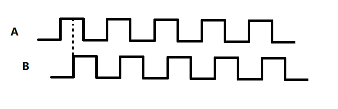
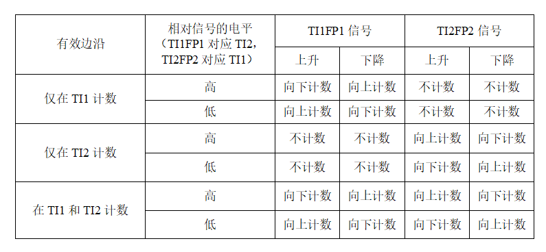
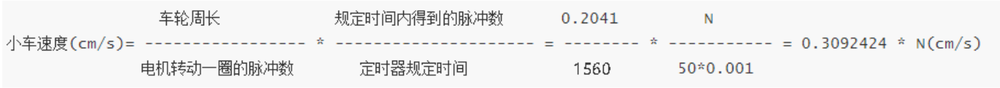

机器人开发过程中，对于直流电机来说，编码器至关重要，它不仅可以使我们对电极进行精确的速度闭环，位置闭环，还可以通过时间积分，根据运动学关系，获得速度、位置等信息

STM32的定时器有编码器模式，大大的方便我们的开发。

我使用STM32作为主控 开发一个机器人中 使用两个定时器TIM5 和TIM4编码器模式读取编码器的值，做闭环控制。

## STM32与编码器测速原理
小车的速度信息的准确获取对于控制系统有着至关重要的影响。编码器是一种将角速度或角位转换成数字脉冲的旋转式传感器，使用者可以通过编码器测量电机的速度信息。在本例程中主要介绍STM32与编码器电机之间的搭配使用方法，关于具体的编码器原理只做简略介绍。

本例程中使用的电机为带霍尔编码器的减速电机，电机由三部分组成：减速器，电机以及霍尔编码器。

霍尔编码器工作原理：霍尔编码器通过电磁转换，将机械的位移转化为脉冲信号，并且输出A、B两相的方波信号，A、B两相脉冲信号相位相差90°，通过检测规定时间内的脉冲数，以及A、B两相脉冲信号的相对位置，便能得到编码器的值与其运动方向。



那么如何测量规定时间内的脉冲数以及两个信号的相位关系呢？

STM32的定时器功能强大，其中部分定时器具有的编码器模式，便可以解决上述问题！通过STM32定时器的编码器模式可以对输入的A、B相信号进行处理。并且STM32的编码器模式可以设置为对TI1、TI2两路信号同时进行脉冲计数，即四倍频！可以提高检测的精度。并且通过检测TI1与TI2的相位关系，计数器可以实现向上计数或向下计数，以此检测其运动方向


对于我使用的电机为13线的霍尔编码器减速电机，减速比为1:30，即转动一圈可以输出13 * 30=330个脉冲，通过STM32四倍频后，电机转动一圈得到的脉冲数为330 * 4= 1560，通过定时器中断设置速度采样周期为50ms，即每50ms读取一次定时器中的计数器值。要得到最终的速度，还需要考虑轮胎的大小，根据小车配套的轮胎直径尺寸为65mm，所以周长C为3.14*6.5=20.41cm。参考以上参数，然后便可以计算小车的运动速度。根据测速原理：设采样周期内传入的脉冲数为N，电机转动一圈得到的脉冲数为 1560，而轮子转动一圈的运动距离为20.41cm。那么得到脉冲数N时运动的距离S=(0.2041 * N/ 1560)，再除以规定的采样周期时间便可以得到运动的速度，完整的计算公式如下：



## STM32代码配置

### 宏定义
```C title="宏定义"
#include "stm32f4xx.h"                  // Device header

#define ENCODER_TIM_PSC 0          /*计数器分频*/
#define ENCODER_TIM_PERIOD 65535   /*计数器最大值*/
#define CNT_INIT 0                  /*计数器初值*/
#define ENCODER_RESOLUTION 13    /*编码器一圈的物理脉冲数*/
#define ENCODER_MULTIPLE 4       /*编码器倍频，通过定时器的编码器模式设置*/
#define MOTOR_REDUCTION_RATIO 30 /*电机的减速比*/
/*电机转一圈总的脉冲数(定时器能读到的脉冲数) = 编码器物理脉冲数*编码器倍频*电机减速比 */
#define TOTAL_RESOLUTION ( ENCODER_RESOLUTION*ENCODER_MULTIPLE*MOTOR_REDUCTION_RATIO )
```

### 定时器5初始化
```C title="tim5_init"
void TIM5_ENCODER_Init(void)                      
{
GPIO_InitTypeDef GPIO_InitStruct;            /*GPIO*/
TIM_TimeBaseInitTypeDef  TIM_TimeBaseStruct; /*时基*/
TIM_ICInitTypeDef TIM_ICInitStruct ;          /*输入通道*/
   /*GPIO初始化*/    
RCC_AHB1PeriphClockCmd(RCC_AHB1Periph_GPIOA, ENABLE); /*使能GPIO时钟 AHB1*/                    
GPIO_StructInit(&GPIO_InitStruct);        
GPIO_InitStruct.GPIO_Pin = GPIO_Pin_0 | GPIO_Pin_1;
GPIO_InitStruct.GPIO_Mode = GPIO_Mode_AF;        /*复用功能*/
GPIO_InitStruct.GPIO_Speed = GPIO_Speed_100MHz; /*速度100MHz*/
GPIO_InitStruct.GPIO_OType = GPIO_OType_PP;  
GPIO_InitStruct.GPIO_PuPd = GPIO_PuPd_NOPULL;        
GPIO_Init(GPIOA, &GPIO_InitStruct);
GPIO_PinAFConfig(GPIOA,GPIO_PinSource0,GPIO_AF_TIM5);
GPIO_PinAFConfig(GPIOA,GPIO_PinSource1,GPIO_AF_TIM5);
/*时基初始化*/
RCC_APB1PeriphClockCmd(RCC_APB1Periph_TIM5, ENABLE);   /*使能定时器时钟 APB1*/
TIM_DeInit(TIM5);  
TIM_TimeBaseStructInit(&TIM_TimeBaseStruct);    
TIM_TimeBaseStruct.TIM_Prescaler = ENCODER_TIM_PSC;       /*预分频 */        
TIM_TimeBaseStruct.TIM_Period = ENCODER_TIM_PERIOD;       /*周期(重装载值)*/
TIM_TimeBaseStruct.TIM_ClockDivision = TIM_CKD_DIV1;      
TIM_TimeBaseStruct.TIM_CounterMode = TIM_CounterMode_Up;  /*连续向上计数模式*/  
TIM_TimeBaseInit(TIM5, &TIM_TimeBaseStruct);
/*编码器模式配置：同时捕获通道1与通道2(即4倍频)，极性均为Rising*/
TIM_EncoderInterfaceConfig(TIM5, TIM_EncoderMode_TI12,TIM_ICPolarity_Rising, TIM_ICPolarity_Rising);
TIM_ICStructInit(&TIM_ICInitStruct);        
TIM_ICInitStruct.TIM_ICFilter = 0;   /*输入通道的滤波参数*/
TIM_ICInit(TIM5, &TIM_ICInitStruct); /*输入通道初始化*/
TIM_SetCounter(TIM5, CNT_INIT);      /*CNT设初值*/
TIM_ClearFlag(TIM5,TIM_IT_Update);   /*中断标志清0*/
TIM_ITConfig(TIM5, TIM_IT_Update, ENABLE); /*中断使能*/
TIM_Cmd(TIM5,ENABLE);                /*使能CR寄存器*/
}
// 读取定时器5计数值 
static int read_encoder_D(void)
{
int encoderNum = 0;
encoderNum = (int)((int16_t)(TIM5->CNT)); /*CNT为uint32, 转为int16*/
TIM_SetCounter(TIM5, CNT_INIT);/*CNT设初值*/

return -encoderNum;
}
```

