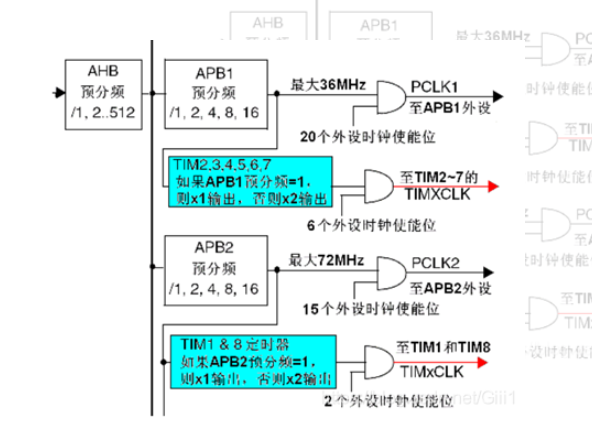
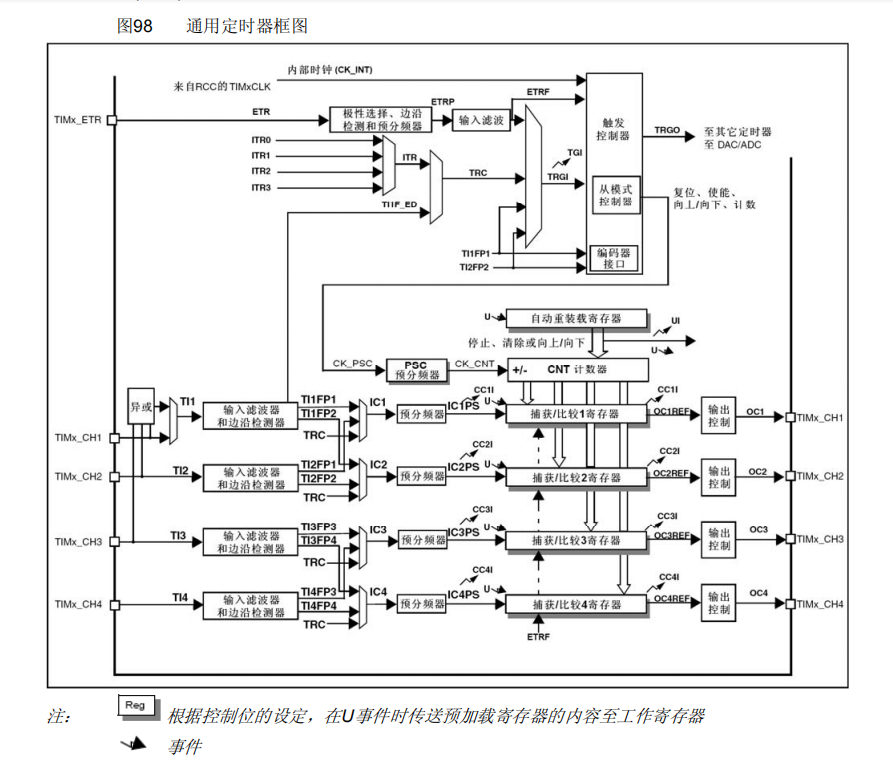

## stm32f10x定时器

对于stm32定时器资源十分丰富，以为本人热衷开发机器人，在选择机器人主控芯片时一般喜欢选择有多达14个定时器资源的stm32f407系列，对于只有几个定时器的arduino来说优秀了太多，利用好了可以实现确定时间间隔的做某件事情，多个定时器中断可以用来做多件事情，不使用延时也能够将程序实现，而且更快，更灵敏。一般我喜欢在裸机开发的时候使用多个定时器进行传感器采集，pid运算等。

## stm32定时器中断周期计算公式

当 APB1 的时钟分频数为 1 的时候，TIM2~7 以及 TIM12~14 的时钟为APB1 的时钟，
而如果 APB1 的时钟分频数不为 1，那么 TIM2~7 以及 TIM12~14 的时钟频率将为 APB1 时钟的两倍

定时器的时钟	    频率
TIM1、TIM8–11	    2*APB2
TIM2—7、TIM12—14	2*APB1



Tout= ((arr+1)*(psc+1))/Tclk；



## STM32代码配置
### 定时器配置
```C title="定时器配置"
void tim_Init(void)
{
		TIM_TimeBaseInitTypeDef timInitStructure;
		NVIC_InitTypeDef 				nvicInitStructure;
		//1.配置定时器时钟
		RCC_APB1PeriphClockCmd(RCC_APB1Periph_TIM3, ENABLE);
		//2.配置定时器结构体
		timInitStructure.TIM_ClockDivision	= TIM_CKD_DIV1;
		timInitStructure.TIM_CounterMode	= TIM_CounterMode_Up;
		timInitStructure.TIM_Period			= 10000-1;
		timInitStructure.TIM_Prescaler		= 7200-1;
		TIM_TimeBaseInit(TIM3, &timInitStructure);
		//3.开启定时器中断
		TIM_ITConfig(TIM3, TIM_IT_Update, ENABLE);
		TIM_Cmd(TIM3, ENABLE);
		//4.配置中断结构体
		NVIC_PriorityGroupConfig(NVIC_PriorityGroup_1);
		
		nvicInitStructure.NVIC_IRQChannel					= TIM3_IRQn;
		nvicInitStructure.NVIC_IRQChannelPreemptionPriority	= 1;
		nvicInitStructure.NVIC_IRQChannelSubPriority		= 1;
		nvicInitStructure.NVIC_IRQChannelCmd				= ENABLE;
		
		NVIC_Init(&nvicInitStructure);
		
		//5.搭建定时器中断服务函数
		
}
void TIM3_IRQHandler(void)
{
}
```

## 注意事项

第一：定时中断函数中尽量不要使用delay函数，容易导致卡中断，触发看门狗。

第二：在用多个定时器注意，不同中断优先级的配置，对于一些需要高优先级的中断函数(例如PID运算)应该尽量保证最高优先级

第三：对于中断函数中的变量如果需要全局使用尽量加上volatile关键字。

该关键字主要用于

1.并行设备的硬件寄存器。存储器映射的硬件寄存器通常加volatile，因为寄存器随时可以被外设硬件修改。当声明指向设备寄存器的指针时一定要用volatile，它会告诉编译器不要对存储在这个地址的数据进行假设。

2.一个中断服务程序中修改的供其他程序检测的变量。volatile提醒编译器，它后面所定义的变量随时都有可能改变。因此编译后的程序每次需要存储或读取这个变量的时候，都会直接从变量地址中读取数据。如果没有volatile关键字，则编译器可能优化读取和存储，可能暂时使用寄存器中的值，如果这个变量由别的程序更新了的话，将出现不一致的现象。

3.多线程应用中被几个任务共享的变量。单地说就是防止编译器对代码进行优化.