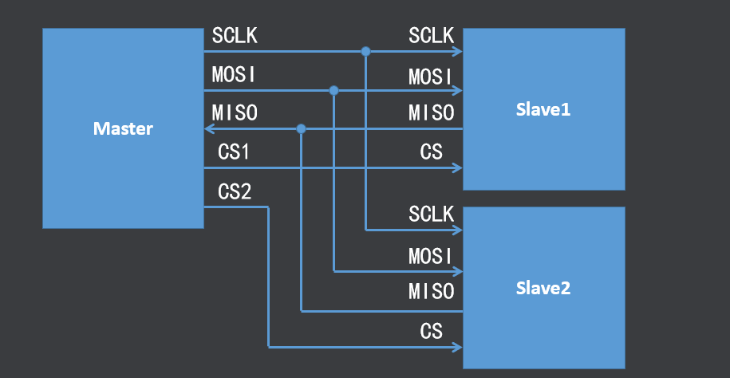
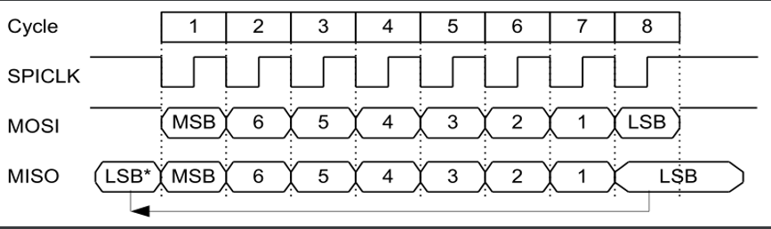
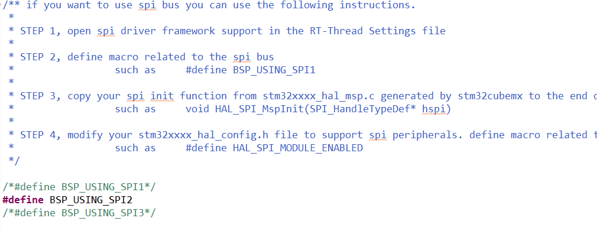
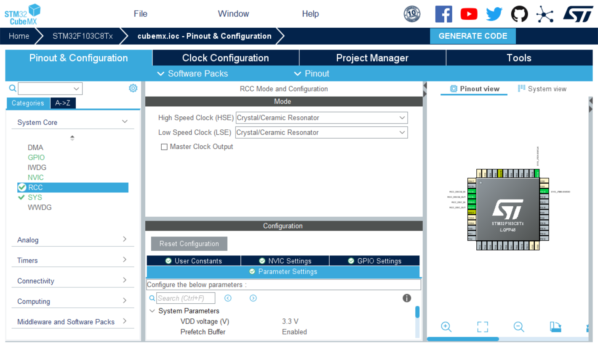
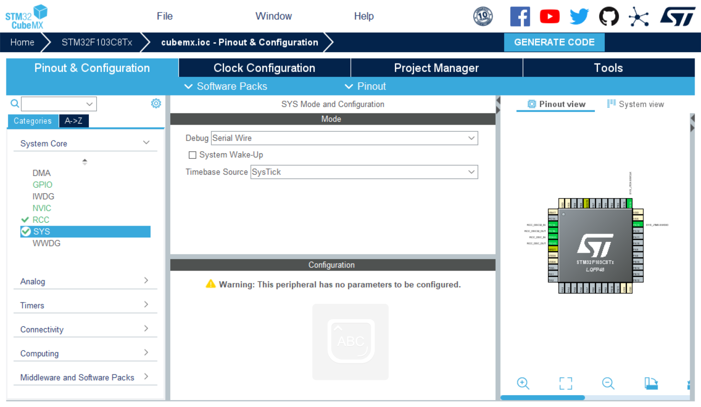
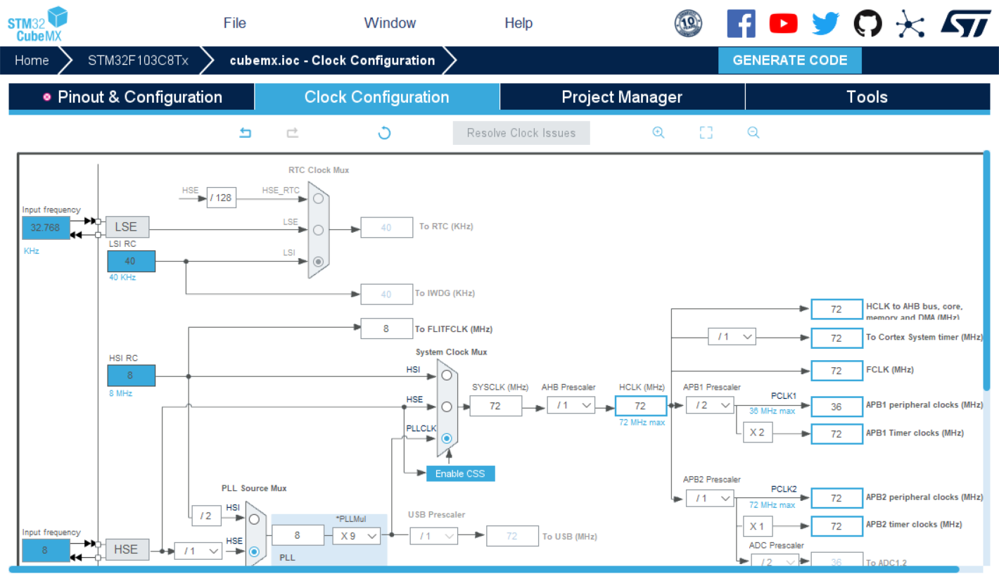

## RT-thread中spi使用
使用STM32F103C8T6配合RT-thread Studio输出spi与can信号，在通过逻辑分析仪解码

### spi介绍
SPI(Serial Peripheral Interface)是串行外设接口的缩写，SPI是一种高速的、全双工、同步的串行通信总线；SPI采用主从方式工作，一般有一个主设备和一个或多个从设备； SPI需要至少4根线，分别是MISO（主设备输入从设备输出）、MOSI（主设备输出从设备输入）、SCLK（时钟）、CS（片选）SPI使用引脚较少且布线方便，所以越来越多的芯片集成了这种通信协议；

当主设备要和某个从设备进行通信时，主设备需要先向对应从设备的片选线上发送使能信号（高电平或者低电平，根据从机而定）表示选中该从设备

SPI总线在进行数据传送时，先传送高位，后传送低位；数据线为高电平表示逻辑‘1’，低电平表示逻辑‘0’；一个字节传送完成后无需应答即可开始下一个字节的传送； SPI总线采用同步方式工作，时钟线在上升沿或下降沿时发送器向数据线上发送数据，在紧接着的下降沿或上升沿时接收器从数据线上读取数据，完成一位数据传送，八个时钟周期即可完成一个字节数据的传送;



### RT-thread Studio中spi使用

1.在borad.h中打开BSP_USING_SPI2并按照上面步骤部署spi驱动


2.在RT-thread Setting 中打开spi驱动

3.配置好stm32CubeMax中spi，时钟，串口等。将Hal库配置代码黏贴到borad.c中。



```C title="时钟初始化"
void system_clock_config(int target_freq_Mhz)
{
    RCC_OscInitTypeDef RCC_OscInitStruct = {0};
      RCC_ClkInitTypeDef RCC_ClkInitStruct = {0};

      /** Initializes the RCC Oscillators according to the specified parameters
      * in the RCC_OscInitTypeDef structure.
      */
      RCC_OscInitStruct.OscillatorType = RCC_OSCILLATORTYPE_HSE;
      RCC_OscInitStruct.HSEState = RCC_HSE_ON;
      RCC_OscInitStruct.HSEPredivValue = RCC_HSE_PREDIV_DIV1;
      RCC_OscInitStruct.HSIState = RCC_HSI_ON;
      RCC_OscInitStruct.PLL.PLLState = RCC_PLL_ON;
      RCC_OscInitStruct.PLL.PLLSource = RCC_PLLSOURCE_HSE;
      RCC_OscInitStruct.PLL.PLLMUL = RCC_PLL_MUL9;
      if (HAL_RCC_OscConfig(&RCC_OscInitStruct) != HAL_OK)
      {
        Error_Handler();
      }

      /** Initializes the CPU, AHB and APB buses clocks
      */
      RCC_ClkInitStruct.ClockType = RCC_CLOCKTYPE_HCLK|RCC_CLOCKTYPE_SYSCLK
                                  |RCC_CLOCKTYPE_PCLK1|RCC_CLOCKTYPE_PCLK2;
      RCC_ClkInitStruct.SYSCLKSource = RCC_SYSCLKSOURCE_PLLCLK;
      RCC_ClkInitStruct.AHBCLKDivider = RCC_SYSCLK_DIV1;
      RCC_ClkInitStruct.APB1CLKDivider = RCC_HCLK_DIV2;
      RCC_ClkInitStruct.APB2CLKDivider = RCC_HCLK_DIV1;

      if (HAL_RCC_ClockConfig(&RCC_ClkInitStruct, FLASH_LATENCY_2) != HAL_OK)
      {
        Error_Handler();
      }
}
```

```C title="SPI_引脚初始化"
void HAL_CAN_MspInit(CAN_HandleTypeDef* hcan)
{
  GPIO_InitTypeDef GPIO_InitStruct = {0};
  if(hcan->Instance==CAN1)
  {
  /* USER CODE BEGIN CAN1_MspInit 0 */

  /* USER CODE END CAN1_MspInit 0 */
    /* Peripheral clock enable */
    __HAL_RCC_CAN1_CLK_ENABLE();

    __HAL_RCC_GPIOA_CLK_ENABLE();
    /**CAN GPIO Configuration
    PA11     ------> CAN_RX
    PA12     ------> CAN_TX
    */
    GPIO_InitStruct.Pin = GPIO_PIN_11;
    GPIO_InitStruct.Mode = GPIO_MODE_INPUT;
    GPIO_InitStruct.Pull = GPIO_NOPULL;
    HAL_GPIO_Init(GPIOA, &GPIO_InitStruct);

    GPIO_InitStruct.Pin = GPIO_PIN_12;
    GPIO_InitStruct.Mode = GPIO_MODE_AF_PP;
    GPIO_InitStruct.Speed = GPIO_SPEED_FREQ_HIGH;
    HAL_GPIO_Init(GPIOA, &GPIO_InitStruct);

  /* USER CODE BEGIN CAN1_MspInit 1 */

  /* USER CODE END CAN1_MspInit 1 */
  }

}

```


4.若出现重定义报错冲突将stm32f1xx_hal_msp.c中代码注释，或者在stm32f1xx_hal_conf.h打开SPI使能.

5.在main.c中添加spi句柄配置与使用，请注意笔者使用的从设备是逻辑分析仪，在spi主设备发送信号之前要手动拉低cs引脚
```C title="SPI-使用"
#include <rtdevice.h>
#include <drv_spi.h>
#define css         GET_PIN(B,12)
#define BME280_SPI_DEVICE_NAME "spi20"
#define BEM280_REG_ID 0XD5
rt_bool_t initialnized = RT_FALSE;

static void spi_bme280_demo(void)
{
    uint8_t data = BEM280_REG_ID | (1 << 7);
    rt_err_t err;

    struct rt_spi_device * spi_bme280;
    if (!initialnized) {
        initialnized = RT_TRUE;
        err = rt_hw_spi_device_attach("spi2", BME280_SPI_DEVICE_NAME, GPIOB, GPIO_PIN_12);
        if (err) {
            rt_kprintf("attach device error\r\n");
            return ;
        }
    }

    spi_bme280 = (struct rt_spi_device *)rt_device_find(BME280_SPI_DEVICE_NAME);
    if (spi_bme280 == RT_NULL) {
        rt_kprintf("find %s error\r\n", BME280_SPI_DEVICE_NAME);
        return ;
    }

    struct rt_spi_configuration cfg = {
            .mode = RT_SPI_MASTER | RT_SPI_MODE_0 | RT_SPI_MSB,
            .data_width = 8,
            .max_hz = 1 * 1000 * 1000
    };
    err = rt_spi_configure(spi_bme280, &cfg);
    if (err != RT_NULL) {
        rt_kprintf("spi configurate error\r\n");
        return ;
    }

    uint8_t send_buf[5] = {data, 0xff};
    uint8_t recv_buf[5];
    rt_pin_write(css, PIN_LOW);
    if (rt_spi_transfer(spi_bme280, send_buf, recv_buf, 2) == 0) {
        rt_kprintf("spi transfer error\r\n");
    }

    rt_kprintf("bme280 id: 0x%02x\r\n", recv_buf[1]);
}

MSH_CMD_EXPORT(spi_bme280_demo, read bme280 id);
```

### RT-thread Studio中CAN使用
PS:有关can协议的具体详解，请看笔者其他专栏。在进行RT-thread中使用can时要注意硬件条件，及波特率。否则会出现can设备句柄无法打开的情况。

1.在borad.h中添加 #define BSP_USING_CAN及#define BSP_USING_CAN1

2.在在RT-thread Setting 中打开CAN驱动，并在stm32f1xx_hal_conf.h打开CAN使能.

3.配置好stm32CubeMax中CAN，时钟，串口等。将Hal库配置代码黏贴到borad.c中，特别注意最好另外打开cubemax生成代码。

4.在main.c中添加代码

```C title="CAN使用"
#include <rtthread.h>
#include "rtdevice.h"
#define CAN_DEV_NAME       "can1"      
static struct rt_semaphore rx_sem;    
static rt_device_t can_dev;            
/* 接收数据回调函数 */
static rt_err_t can_rx_call(rt_device_t dev, rt_size_t size)
{
    /* CAN 接收到数据后产生中断，调用此回调函数，然后发送接收信号量 */
    rt_sem_release(&rx_sem);
    return RT_EOK;
}
static void can_rx_thread(void *parameter)
{
    int i;
    rt_err_t res;
    struct rt_can_msg rxmsg = {0};
    /* 设置接收回调函数 */
    rt_device_set_rx_indicate(can_dev, can_rx_call);

    while (1)
    {
        /* hdr 值为 - 1，表示直接从 uselist 链表读取数据 */
        rxmsg.hdr = -1;
        /* 阻塞等待接收信号量 */
        rt_sem_take(&rx_sem, RT_WAITING_FOREVER);
        /* 从 CAN 读取一帧数据 */
        rt_device_read(can_dev, 0, &rxmsg, sizeof(rxmsg));
        /* 打印数据 ID 及内容 */
        rt_kprintf("ID:%x", rxmsg.id);
        for (i = 0; i < 8; i++)
        {
            rt_kprintf("%2x", rxmsg.data[i]);
        }
        rt_kprintf("\n");
    }
}
int can_sample(int argc, char *argv[])
{
    struct rt_can_msg msg = {0};
    rt_err_t res;
    rt_size_t  size;
    rt_thread_t thread;
    char can_name[RT_NAME_MAX];
    if (argc == 2)
    {
        rt_strncpy(can_name, argv[1], RT_NAME_MAX);
    }
    else
    {
        rt_strncpy(can_name, CAN_DEV_NAME, RT_NAME_MAX);
    }
    /* 查找 CAN 设备 */
    can_dev = rt_device_find(can_name);
    if (!can_dev)
    {
        rt_kprintf("find %s failed!\n", can_name);
        return RT_ERROR;
    }
    /* 初始化 CAN 接收信号量 */
    rt_sem_init(&rx_sem, "rx_sem", 0, RT_IPC_FLAG_FIFO);
    /* 以中断接收及发送方式打开 CAN 设备 */
    res = rt_device_open(can_dev, RT_DEVICE_FLAG_INT_TX | RT_DEVICE_FLAG_INT_RX);
    RT_ASSERT(res == RT_EOK);
    /* 创建数据接收线程 */
    thread = rt_thread_create("can_rx", can_rx_thread, RT_NULL, 1024, 25, 10);
    if (thread != RT_NULL)
    {
        rt_thread_startup(thread);
    }
    else
    {
        rt_kprintf("create can_rx thread failed!\n");
    }
    msg.id = 0x78;              /* ID 为 0x78 */
    msg.ide = RT_CAN_STDID;     /* 标准格式 */
    msg.rtr = RT_CAN_DTR;       /* 数据帧 */
    msg.len = 8;                /* 数据长度为 8 */
    /* 待发送的 8 字节数据 */
    msg.data[0] = 0x00;
    msg.data[1] = 0x11;
    msg.data[2] = 0x22;
    msg.data[3] = 0x33;
    msg.data[4] = 0x44;
    msg.data[5] = 0x55;
    msg.data[6] = 0x66;
    msg.data[7] = 0x77;
    /* 发送一帧 CAN 数据 */
    size = rt_device_write(can_dev, 0, &msg, sizeof(msg));
    if (size == 0)
    {
        rt_kprintf("can dev write data failed!\n");
    }
    return res;
}
void can_send_test(void)
{
    struct rt_can_msg msg = {0};
    rt_size_t  size;
    static rt_uint8_t num = 0;
    msg.id = 0x78;              /* ID 为 0x78 */
    msg.ide = RT_CAN_STDID;     /* 标准格式 */
    msg.rtr = RT_CAN_DTR;       /* 数据帧 */
    msg.len = 8;                /* 数据长度为 8 */
    /* 待发送的 8 字节数据 */
    msg.data[0] = 0x00;
    msg.data[1] = num++;
    msg.data[2] = 0x22;
    msg.data[3] = 0x33;
    msg.data[4] = num++;
    msg.data[5] = 0x55;
    msg.data[6] = 0x66;
    msg.data[7] = 0x77;
    /* 发送一帧 CAN 数据 */
    size = rt_device_write(can_dev, 0, &msg, sizeof(msg));
    if (size == 0)
    {
        rt_kprintf("can dev write data failed!\n");
    }
}
/* 导出到 msh 命令列表中 */
MSH_CMD_EXPORT(can_sample, can device sample);
MSH_CMD_EXPORT(can_send_test, can send test);
```