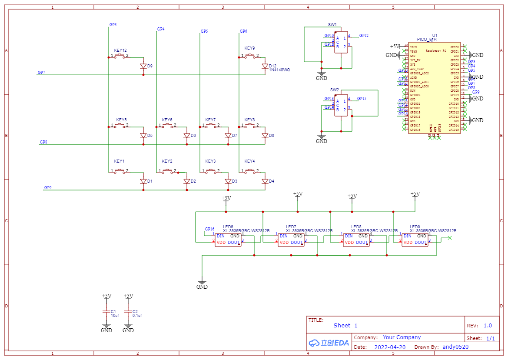
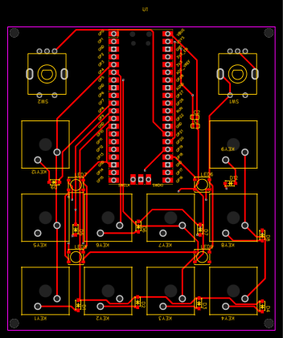
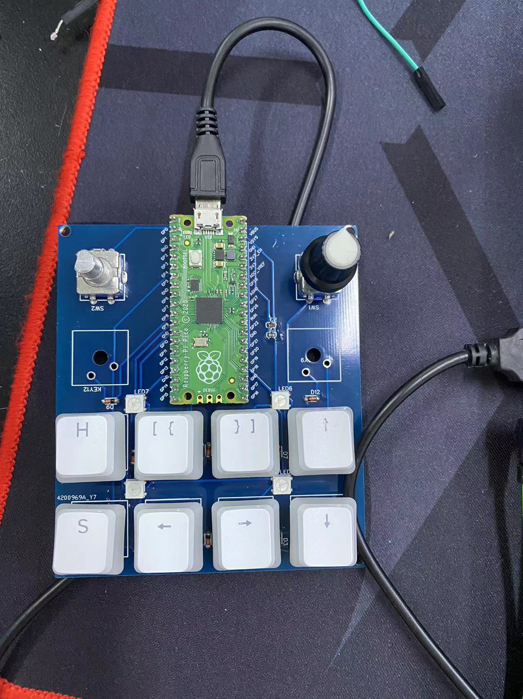

## 硬件
采用矩阵键盘和二极管进行4x3键盘搭建，使用树莓派Raspberry Pi Pico作为主控，配合旋转编码器及贴片RGB构成
原理图：

PCB版：

具体硬件文件可以去[我GitHub](https://github.com/andy817501/Raspberry-Pi-Pico-keyboard/tree/main/hardware)中查看

## 软件
软件部分采用python语言，是哟kmk库，模拟键盘输出，及rgb灯光与MIDI功能
具体代码可以去[我GitHub](https://github.com/andy817501/Raspberry-Pi-Pico-keyboard/tree/main/software)中查看

目前键盘主要是作为辅助键盘，通过绑定快捷键宏定义辅助代码编写。
