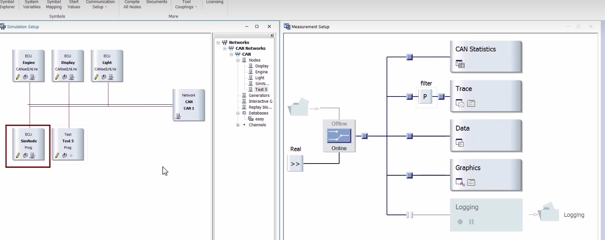
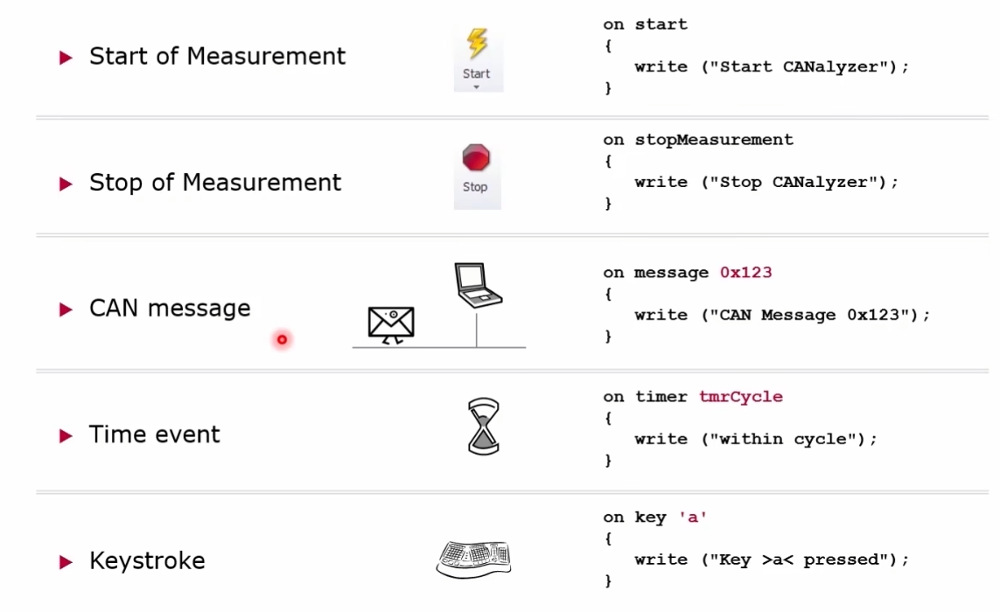
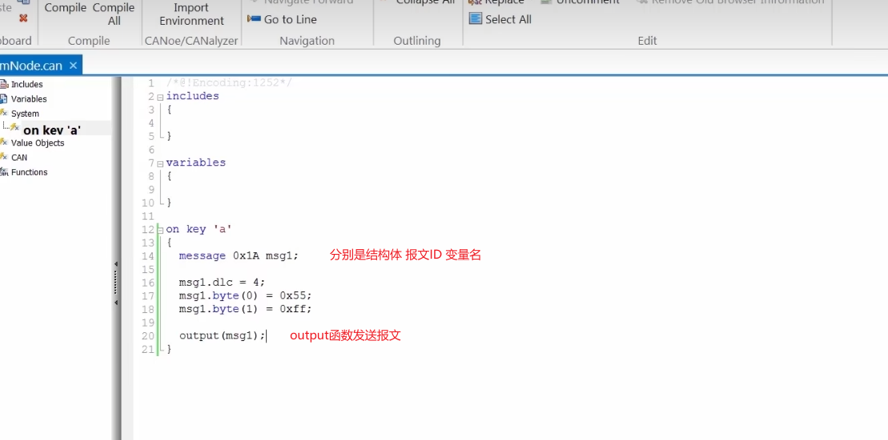

### CAPL简介
CAPL可以说是CANoe的灵魂，使CANoe满足仿真、分析、测试和诊断的各种复杂的要求，同时使CANoe的功能得以不断扩展。概括起来，CAPL的主要用途有以下几点。
（1）使用易于理解的编程语言来仿真节点或模块；
（2）仿真事件报文、周期报文或者附加条件的重复报文；
（3）使用PC键盘模拟操作按钮等人工操作事件；
（4）仿真节点的定时或网络事件；
（5）仿真多个时间事件，每个事件有自己的特定行为；
（6）仿真普通操作、诊断或生产操作；
（7）仿真物理参数或报文的变化；
（8）生成错误帧，评估模块和网络软件处理机制；
（9）仿真模块或网络错误来评估相关的防错机制；
（10）提供网络测试、诊断等功能测试库函数

### 初步使用

在双击后进入CAPL Browser

### Event 事件
    不和其他语言运行顺序从上到下，CAPL语言是由事件触发，除非是周期性信号事件，否则不会有明确的运行顺序
 
 
### 发送报文方法
     
     