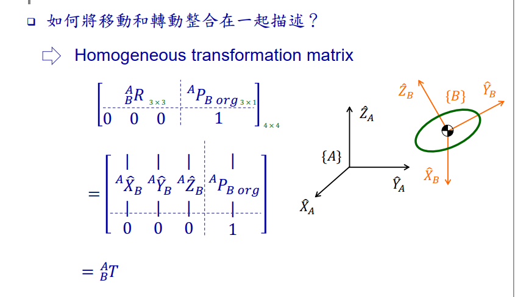
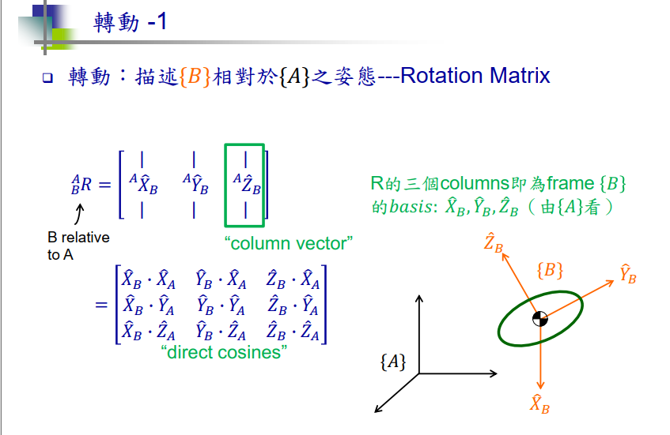
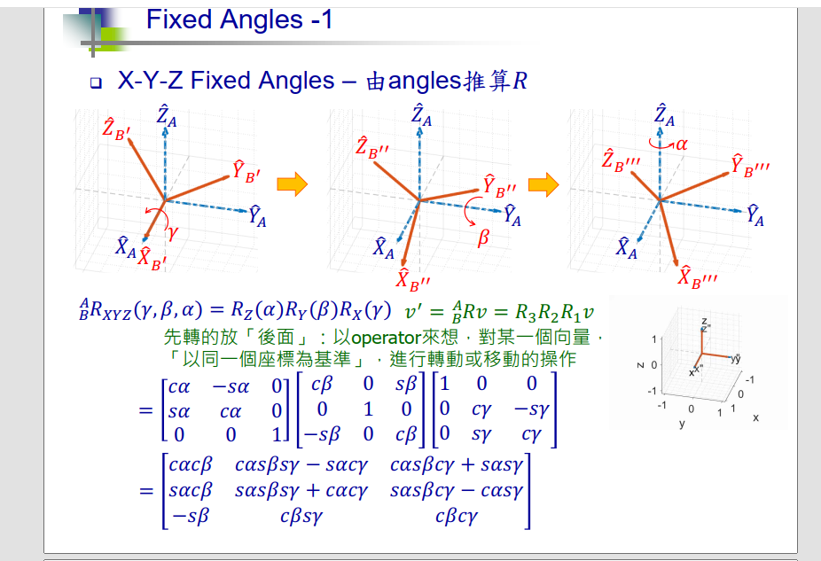
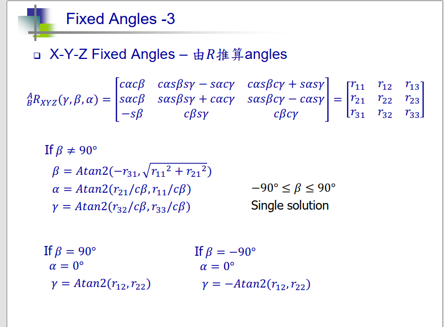
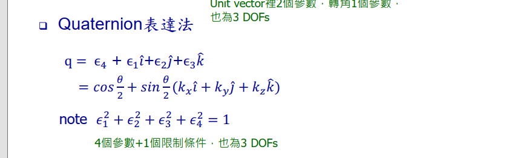

## 核心公式

将平移与旋转融合成正交矩阵。

## 旋转矩阵推导

### 一 向量法
 知道坐标系与相对坐标系每个轴的夹角

### 二 欧拉角

知道坐标系与相对坐标系每个轴依次的旋转角度

这是正解还可以通过旋转矩阵求得每个轴旋转角度

这也是常说的欧拉角(Roll,Pitch,Yaw)，但是会出现万向节死锁情况---当Pitch角度为90°时，其他角会失去意义。

### 三 四元数

