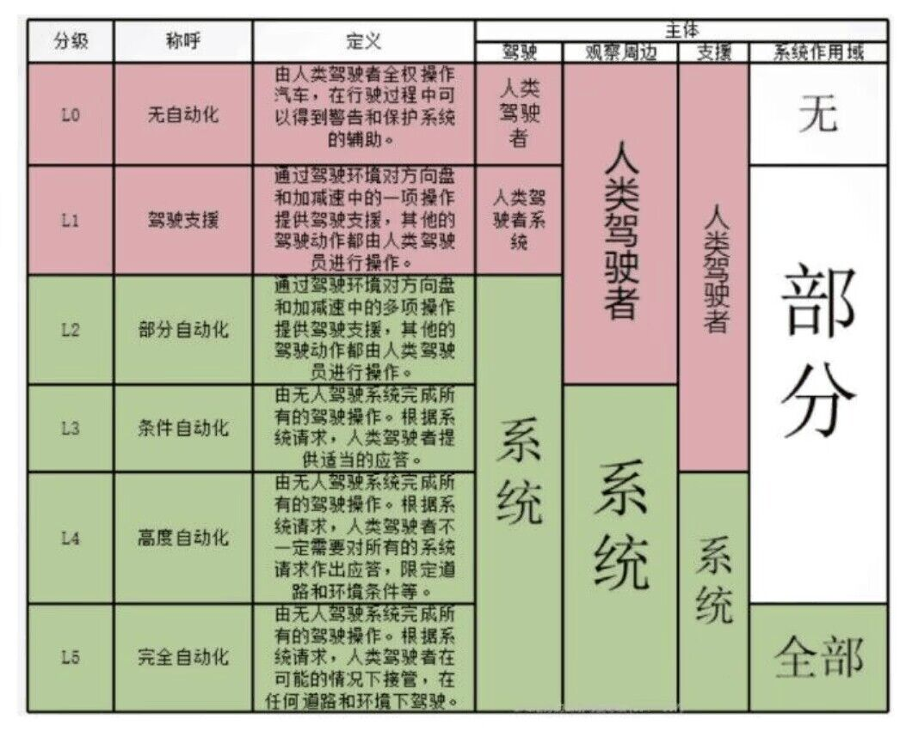

## 智能驾驶等级分类

L0 级别：这个就是完全由驾驶员进行操作驾驶，包括转向、制动、油门等都由驾驶员自行判断，汽车只负责命令的执行。

L1 级别：能够辅助驾驶员完成某些驾驶任务，例如许多车型装配的自适应巡航(ACC)功能，雷达实时控制车距和车辆加减速，在国内的很多车型上都有应用。

L2 级别：可自动完成某些驾驶任务，并经过处理分析，自动调整车辆状态，像特斯拉的车道保持功能就属于此级别，除了能控制加减速，同时还能对方向盘进行控制，驾驶员需观察周围情况提供车辆安全操作。

L3 级别：该级别通过更有逻辑性的行车电脑控制车辆，驾驶员不需要手脚待命，车辆能够在特定环境下独立完成操作驾驶，但驾驶员无法进行睡眠或休息，在人工智能不能准确判断时，仍需人工操作。前不久刚发布的宝马 X7 自称已实现这一技术层面的自动驾驶了。

L4 级别：车辆自动做出自主决策，并且驾驶者无需任何操作，一般需依靠可实时更新的道路信息数据支持，实现自动取还车、自动编队巡航、自动避障等出行的真实场景。

L5 级别：与 L4 级别最大的区别是完全不需要驾驶员配合任何操作，实现全天候、全地域的自动驾驶，并能应对环境气候及地理位置的变化，驾驶员可将注意力放在休息或其它工作上。