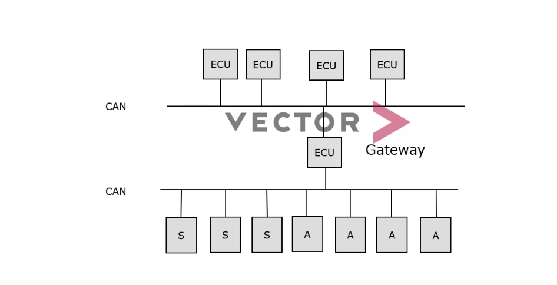
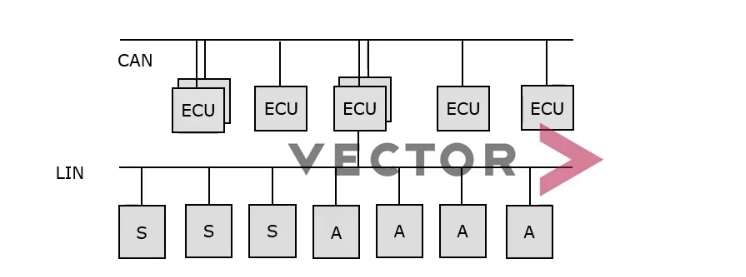
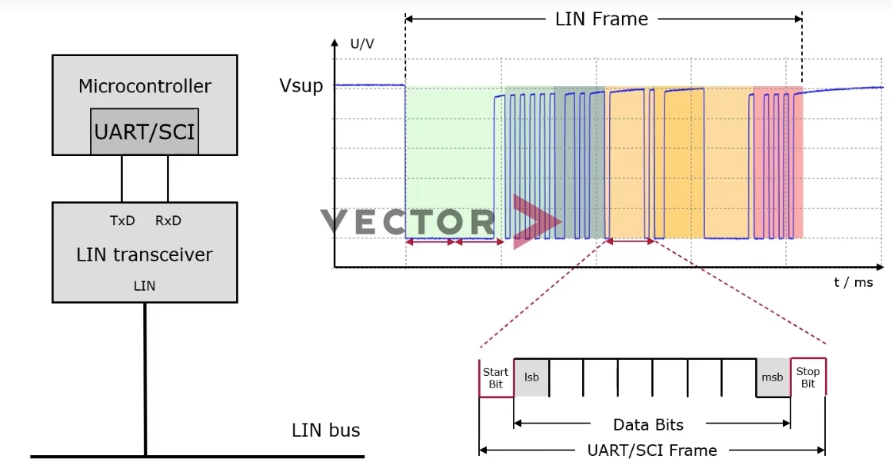
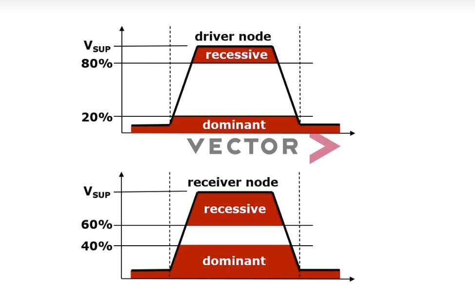
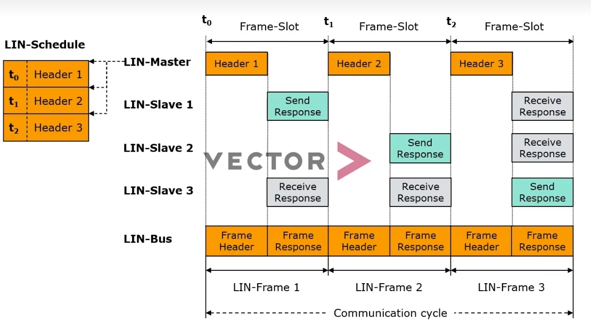
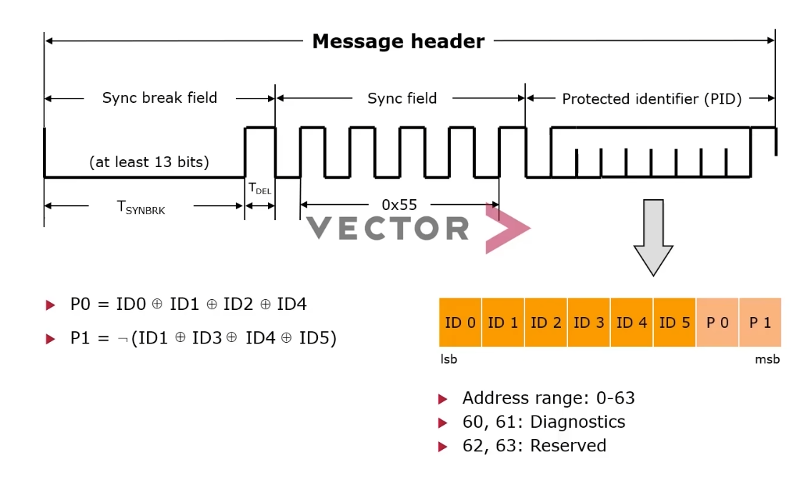
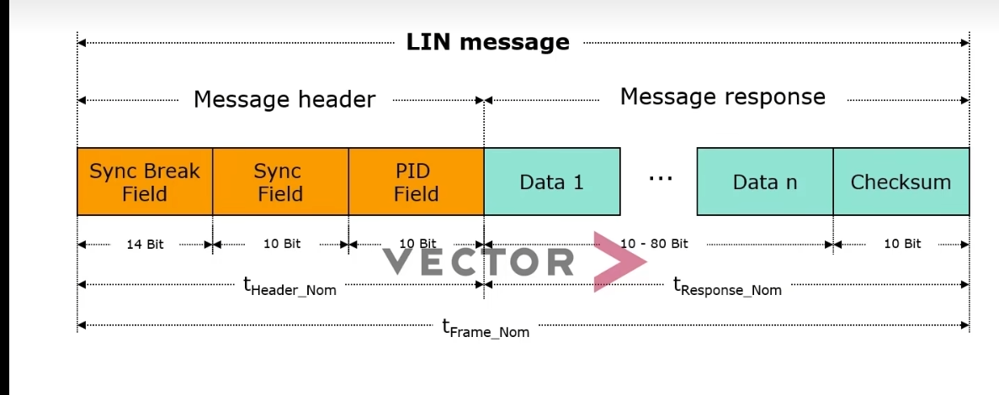

对于传统点对点，随汽车工业发展，点对点导致功耗增加，汽车重量，可靠性，都受到影响。提出了LIN总线与CAN总线，但是需要CAN总线收发器，提高了总线负载。对此提出了LIN总线。

can与lin总线接线对比

 ## LIN物理层

 

解除了can收发器的限制，减小的成本，通过总线上与uart进行接口，从而减小总线负担

 

 lin总线同样与can总线一样分为显性与隐形,显性电平的逻辑值为“0”，隐性电平为“1”。

 ## lin总线通讯帧
 
 LIN协议是一主多从的通讯模式，通讯报文由head+response组成

  

从这个图可以看出每个数据的回复，发送时间都是固定的。

  

  

Break场

Break场不同与其他场，它有意的造成UART通信中的FramingError（从起始位到第10位没有检出停止位时的错误）来提示LIN总线中的所有从节点之后要开始进行LIN报文的传输了。

Break场又可以分为“Break”，“Break-delimiter”，“Break”为13位以上的显性位，“Break-delimiter”为1位的隐形位，“Break-delimiter”是“Break”结束的标志。

Synch场

Synch场即同步场，第一讲在介绍同期信号时提到过同步场。同步场是为了修正各个节点间时钟的误差，固定发送0x55的UART数据（包含起始位/停止位）。从节点根据最初和最终的下降沿除以8来算出1位的时间，并以此作为基准来调整自己的时钟误差（图 2）。如果从节点使用的是高精度时钟的话（允许误差±1.5%），则不需要调整时钟的误差。

PID场标识LIN报文识别信息，由6位（位0~位5）的报文ID和2位（位6、位7）的奇偶校验位，合计8位组成（图3）。
ID范围 0-0x3f

Response

Response由“数据”和“和校验”2个场组成。都可以通过UART的形式进行传输。

 
