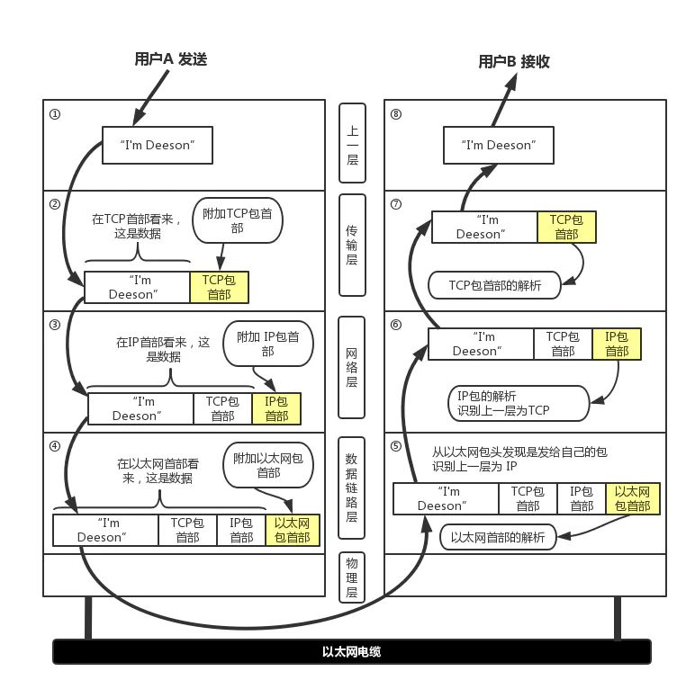
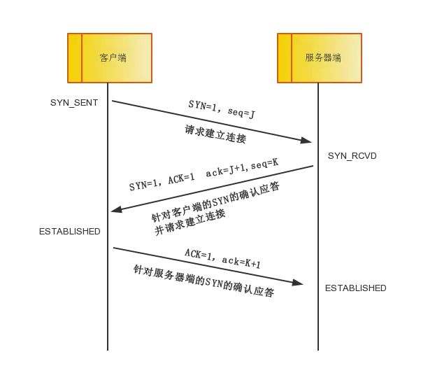
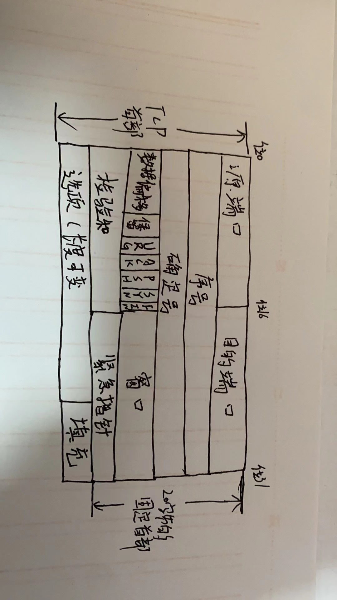
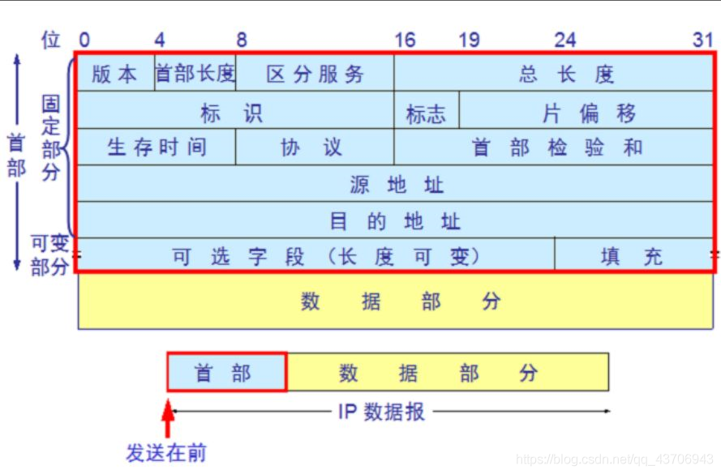

## 网络分层

每个分层中，都会对所发送的数据附加一个首部，在这个首部中包含了该层必要的信息，如发送的目标地址以及协议相关信息。通常，为协议提供的信息为包首部，所要发送的内容为数据。在下一层的角度看，从上一层收到的包全部都被认为是本层的数据。

### 应用层
TCP/IP模型将OSI参考模型中的会话层和表示层的功能合并到应用层实现。这一层主要的代表有DNS域名解析/http协议

### 传输层
在TCP/IP模型中，传输层的功能是使源端主机和目标端主机上的对等实体可以进行会话。在传输层定义了两种服务质量不同的协议。即：传输控制协议TCP和用户数据报协议UDP.

### 网络层
网络层是整个TCP/IP协议栈的核心。它的功能是把分组发往目标网络或主机。同时，为了尽快地发送分组，可能需要沿不同的路径同时进行分组传递。因此，分组到达的顺序和发送的顺序可能不同，这就需要上层必须对分组进行排序。网络层定义了分组格式和协议，即IP协议（Internet Protocol ）。

### 物理层
该层负责比特流在节点之间的传输，即负责物理传输，这一层的协议既与链路有关，也与传输的介质有关。通俗来说就是把计算机连接起来的物理手段。

数据链路层
控制网络层与物理层之间的通信，主要功能是保证物理线路上进行可靠的数据传递。为了保证传输，从网络层接收到的数据被分割成特定的可被物理层传输的帧。帧是用来移动数据结构的结构包，他不仅包含原始数据，还包含发送方和接收方的物理地址以及纠错和控制信息。其中的地址确定了帧将发送到何处，而纠错和控制信息则确保帧无差错到达。如果在传达数据时，接收点检测到所传数据中有差错，就要通知发送方重发这一帧。

### 分层好处

各层独立:限制了依赖关系的范围，各层之间使用标准化的接口，各层不需要知道上下层是如何工作的，增加或者修改一个应用层协议不会影响传输层协议。

灵活性更好:比如路由器不需要应用层和传输层，分层以后路由器就可以只用加载更少的几个协议层。

易于测试和维护:提高了可测试性，可以独立的测试特定层，某一层有了更好的实现可以整体替换掉。

能促进标准化:每一层职责清楚，方便进行标准化。

## 3次握手

`第一次握手`：客户端将标志位SYN置为1，随机产生一个值seq=J，并将该数据包发送给服务器端，客户端进入SYN_SENT状态，等待服务器端确认。

`第二次握手`：服务器端收到数据包后由标志位SYN=1知道客户端请求建立连接，服务器端将标志位SYN和ACK都置为1，ack=J+1，随机产生一个值seq=K，并将该数据包发送给客户端以确认连接请求，服务器端进入SYN_RCVD状态。

`第三次握手`：客户端收到确认后，检查ack是否为J+1，ACK是否为1，如果正确则将标志位ACK置为1，ack=K+1，并将该数据包发送给服务器端，服务器端检查ack是否为K+1，ACK是否为1，如果正确则连接建立成功，客户端和服务器端进入ESTABLISHED状态，完成三次握手，随后客户端与服务器端之间可以开始传输数据了。

`为什么要进行三次握手呢?` 第三次握手是为了防止失效的连接请求到达服器，让服务器错误打开连接。客户端发送的连接请求如果在网络中滞留，那么就会隔很长一段时间才能收到服务器端发回的连接确认。客户端等待一个超时重传时间之后，就会重新请求连接。但是这个滞留的连接请求最后还是会到达服务器，如果不进行三次握手，那么服务器就会打开两个连接。如果有第三次握手，客户端会忽略服务器之后发送的对滞留连接请求的连接确认，不进行第三次握手，因此就不会再次打开连接。

`如果此时变成两次挥手行不行？`举个打电话的例子，比如：第一次握手：A给B打电话说，你可以听到我说话吗？第二次握手：B收到了A的信息，然后对A说：我可以听得到你说话啊，你能听得到我说话吗？第三次握手：A收到了B的信息，然后说可以的，我要给你发信息啦！结论：在三次握手之后，A和B都能确定这么一件事：我能听到你，你也能听到我。这样，就可以开始正常通信了。如果是两次，那将无法确定。

## 4次挥手

中断连接端可以是客户端，也可以是服务器端。

`第一次挥手`：客户端发送一个FIN=M，用来关闭客户端到服务器端的数据传送，客户端进入FIN_WAIT_1状态。意思是说"我客户端没有数据要发给你了"，但是如果你服务器端还有数据没有发送完成，则不必急着关闭连接，可以继续发送数据。

`第二次挥手`：服务器端收到FIN后，先发送ack=M+1，告诉客户端，你的请求我收到了，但是我还没准备好，请继续你等我的消息。这个时候客户端就进入FIN_WAIT_2 状态，继续等待服务器端的FIN报文。

`第三次挥手`：当服务器端确定数据已发送完成，则向客户端发送FIN=N报文，告诉客户端，好了，我这边数据发完了，准备好关闭连接了。服务器端进入LAST_ACK状态。

`第四次挥手`：客户端收到FIN=N报文后，就知道可以关闭连接了，但是他还是不相信网络，怕服务器端不知道要关闭，所以发送ack=N+1后进入TIME_WAIT状态，如果Server端没有收到ACK则可以重传。服务器端收到ACK后，就知道可以断开连接了。客户端等待了2MSL后依然没有收到回复，则证明服务器端已正常关闭，那好，我客户端也可以关闭连接了。最终完成了四次握手。

`为什么要四次挥手？`
客户端发送了 FIN 连接释放报文之后，服务器收到了这个报文，就进入了 CLOSE-WAIT 状态。这个状态是为了让服务器端发送还未传送完毕的数据，传送完毕之后，服务器会发送 FIN 连接释放报文。

`HTTP持久连接`
如果有大量的连接，每次在连接，关闭都要经历三次握手，四次挥手，这显然会造成性能低下。因此。Http 有一种叫做 长连接（keepalive connections） 的机制。它可以在传输数据后仍保持连接，当客户端需要再次获取数据时，直接使用刚刚空闲下来的连接而无需再次握手。

## TCP报文首部格式

`源端口和目的端口`: 各占两个字节，分别写入源端口号和目的端口号。

`序号`：占4个字节；用于对字节流进行编号，例如序号为 301，表示第一个字节的编号为 301，如果携带的数据长度为 100 字节，那么下一个报文段的序号应为 401。

`确认号`：占4个字节；期望收到的下一个报文段的序号。例如 B 正确收到 A 发送来的一个报文段，序号为 501，携带的数据长度为 200 字节，因此 B 期望下一个报文段的序号为 701，B 发送给 A 的确认报文段中确认号就为 701。

`数据偏移`：占4位；指的是数据部分距离报文段起始处的偏移量，实际上指的是首部的长度。

`确认 ACK`：当 ACK=1 时确认号字段有效，否则无效。TCP 规定，在连接建立后所有传送的报文段都必须把 ACK 置 1。

`同步 SYN` ：在连接建立时用来同步序号。当 SYN=1，ACK=0 时表示这是一个连接请求报文段。若对方同意建立连接，则响应报文中 SYN=1，ACK=1。
`终止 FIN`：用来释放一个连接，当 FIN=1 时，表示此报文段的发送方的数据已发送完毕，并要求释放连接。

`窗口`：占2字节；窗口值作为接收方让发送方设置其发送窗口的依据。之所以要有这个限制，是因为接收方的数据缓存空间是有限的。

`检验和`： 占2个字节；检验和字段检验的范围包括首部和数据这两个部分。在计算检验和时，在TCP报文段的前面加上12字节的伪首部。

`套接字`： TCP连接的端点叫做套接字或插口。端口号拼接到IP地址即构成了套接字。

## IP报文首部格式

`版本号`：长度4比特。标识目前采用的IP协议的版本号。一般的值为0100（IPv4），0110（IPv6）

`IP包头长度`：长度4比特。这个字段的作用是为了描述IP包头的长度，因为在IP包头中有变长的可选部分。该部分占4个bit位，单位为32bit（4个字节），即本区域值= IP头部长度（单位为bit）/(84)，因此，一个IP包头的长度最长为“1111”，即154＝60个字节。IP包头最小长度为20字节。

`服务类型`：长度8比特。8位 按位被如下定义 PPP D T R C 0

PPP：定义包的优先级

000 普通 (Routine)

001 优先的 (Priority)

010 立即的发送 (Immediate)

011 闪电式的 (Flash)

100 比闪电还闪电式的 (Flash Override)

101 CRI/TIC/ECP (不知道虾米意思)

110 网间控制 (Internetwork Control)

111 网络控制 (Network Control)

D 时延: 0:普通 1:尽量小

T 吞吐量: 0:普通 1:尽量大

R 可靠性: 0:普通 1:尽量大

M 传输成本: 0:普通 1:尽量小

0 最后一位被保留，恒定为0

`IP包总长`：长度16比特。 以字节为单位计算的IP包的长度 (包括头部和数据)，所以IP包最大长度65535字节。

`标识符`:长度16比特。该字段和Flags和Fragment Offest字段联合使用，对大的上层数据包进行分段（fragment）操作。路由器将一个包拆分后，所有拆分开的小包被标记相同的值，以便目的端设备能够区分哪个包属于被拆分开的包的一部分。

`标记`：长度3比特。该字段第一位不使用。第二位是DF（Don’t Fragment）位，DF位设为1时表明路由器不能对该上层数据包分段。如果一个上层数据包无法在不分段的情况下进行转发，则路由器会丢弃该上层数据包并返回一个错误信息。第三位是MF（More Fragments）位，当路由器对一个上层数据包分段，则路由器会在除了最后一个分段的IP包的包头中将MF位设为1。

`片偏移`：长度13比特。表示该IP包在该组分片包中位置，接收端靠此来组装还原IP包。

`生存时间`：长度8比特。当IP包进行传送时，先会对该字段赋予某个特定的值。当IP包经过每一个沿途的路由器的时候，每个沿途的路由器会将IP包的TTL值减少1。如果TTL减少为0，则该IP包会被丢弃。这个字段可以防止由于路由环路而导致IP包在网络中不停被转发。

`协议`：长度8比特。标识了上层所使用的协议。
以下是比较常用的协议号：

1 ICMP

2 IGMP

6 TCP

17 UDP

88 IGRP

89 OSPF

`头部校验`：长度16位。用来做IP头部的正确性检测，但不包含数据部分。 因为每个路由器要改
变TTL的值,所以路由器会为每个通过的数据包重新计算这个值。

`起源和目标地址`：这两个地段都是32比特。标识了这个IP包的起源和目标地址。要注意除非使用NAT，否则整个传输的过程中，这两个地址不会改变。

