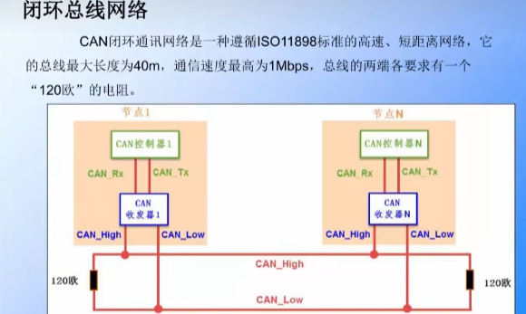
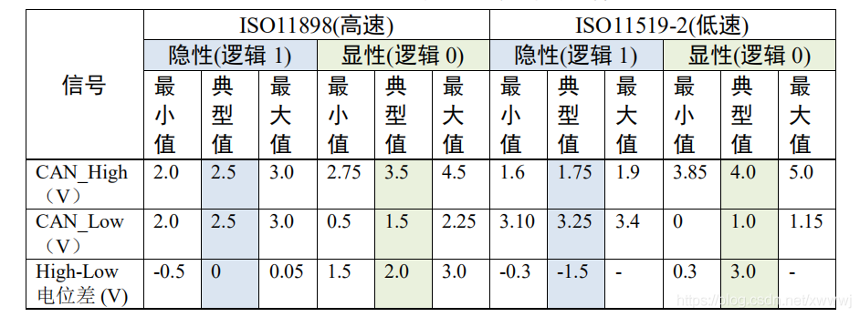
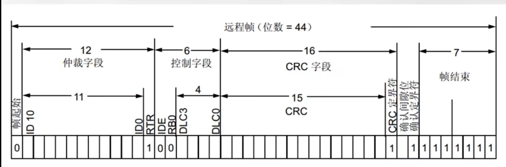

## CAN通讯协议物理层

CAN与IIC,SPI等具有sclk信号的同步通讯方式不同，只用CAN_L,CAN_H两条线，是一种异步通讯方式，以差分信号的形式进行通讯。

CAN物理层的形式主要分位闭环总线和开环总线网络两种，一种适合高速通讯(汽车一般使用这个)（ 最高速度可达1Mbps,最长距离40m.），一种适合远距离通讯（最高速度125Kbps，最远距离1km.）。

## CAN通信协议协议层
### CAN的波特率及位同步

由于CAN属于异步通讯，没有时钟信号线，连接在同一个总线网络中的各个节点会像串口异步通讯那样，节点间使用约定好的波特率进行通讯，特别地，CAN还会使用“位同步”的方式来抗干扰、吸收误差，实现对总线电平信号进行正确的采样，确保通讯正常

### CAN的差分信号

0V---------逻辑1------隐形电平
2.0V-------逻辑0-----显性电平

### CAN的位同步

SS段： 又叫做同步段，它的作用就是判断节点与总线的时序是否一致，如何判断我们稍后再讲。先留一个疑点。它的长度为1tq，tq就相当于一个时间单位，我们可以规定它的大小，一般tq=1us.
PTS段： 传播时间段，用于补偿网络的延时时间
PBS1,PBS2： 都是用来补偿阶段的误差。

### CAN的数据帧
1.标准数据帧

RTR决定是数据帧还是远程帧

IDE决定是标准帧还是扩展帧

数据位最长可以发送8个字节，这也是缺点只能一次发送8个字节

2.扩展数据帧

3.标准远程帧

4.扩展远程帧

### CAN的屏蔽滤波功能
1.屏蔽位模式

在屏蔽位模式下，标识符寄存器和屏蔽寄存器一起，指定报文标识符的任何一位，应该按照“必须匹配”或“不用关心”处理。

2.标识符列表模式
在标识符列表模式下，屏蔽寄存器也被当作标识符寄存器用。因此，不是采用一个标识符加一个屏蔽位的方式，而是使用2个标识符寄存器。接收报文标识符的每一位都必须跟过滤器标识符相同。

为了过滤出一组标识符，应该设置过滤器组工作在屏蔽位模式。
为了过滤出一个标识符，应该设置过滤器组工作在标识符列表模式。