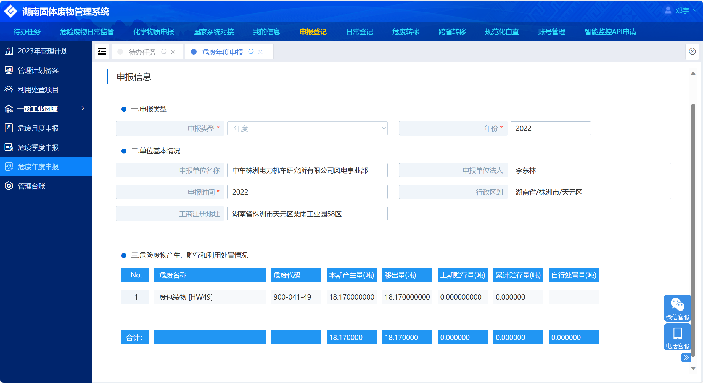

# 中车株洲电力机车研究所有限公司风电事业部
# 有害物质使用情况、能源资源利用效率、年度污染物排放情况
### 一、能源资源利用效率

中车株洲电力机车研究所有限公司风电事业部总用能结构为100%电能，能源资源利用情况具体如下表格：

| 月份 | 电量（千瓦时） | 电费（元）      |
|----|---------|------------|
| 1  | 127454  | 111654.54  |
| 2  | 98537   | 93495.09   |
| 3  | 89038   | 86066.62   |
| 4  | 82425   | 78181.25   |
| 5  | 76413   | 65964.82   |
| 6  | 86302   | 75662.39   |
| 7  | 140470  | 122295.36  |
| 8  | 159709  | 147498.64  |
| 9  | 117354  | 111712.29  |
| 10 | 89429   | 81557.7    |
| 11 | 112485  | 105324.07  |
| 12 | 190430  | 186547.51  |
| 合计 | 1370046 | 1265960.28 |

### 二、年度污染物排放情况汇总：
#### 1、废水排放情况：
2022年全年消耗新鲜水67870m3（其中循环水池用水13000m3、车间卫生用水33870m3、办公生活21000m3），仅产生生活污水，不产生生产废水，年废水产生量为67870t,废水排放量为67870t，全部排入株洲市河西污水处理厂。

按监测报告，厂区废水COD排放浓度均值为284mg/L，NH3-N浓度为55.4 mg/L。
#### 2、废气排放情况：
生产过程主要工作为大部件的吊装、连接螺栓的紧固装配、各电气部件之间的布线接线，不消耗燃料，全过程无有组织废气排放，不产生环保部门重点监管的S02 、NOx、VOCs等污染物。
#### 3、危废处置情况：
2022年全年共产生18.17吨危险废物，均通过具备资质的危废处置公司进行转移处置，并在湖南省固体废物管理信息平台申报备案。

### 三、有害物质使用情况：
中车株洲电力机车研究所有限公司风电事业部生产过程中使用的原料多为合金制品，辅料中化学品主要为润滑油脂、清洗剂、防腐涂料这三类，均符合国家相关法律法规要求，不产生任何有害物质。以下为使用情况及检测报告：

| 序号 | 物料名称 | 性质  | 单台用量 | 年度用量   | 单位 |
|----|------|-----|------|--------|----|
| 1  | 润滑油脂 | 化学品 | 950  | 665000 | Kg |
| 2  | 清洗剂  | 化学品 | 45   | 31500  | L  |
| 3  | 防腐涂料 | 化学品 | 6    | 4200   | Kg |

